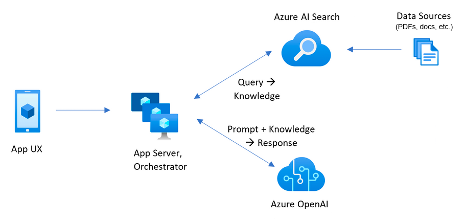
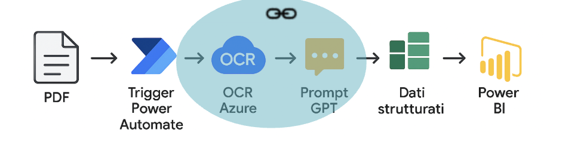
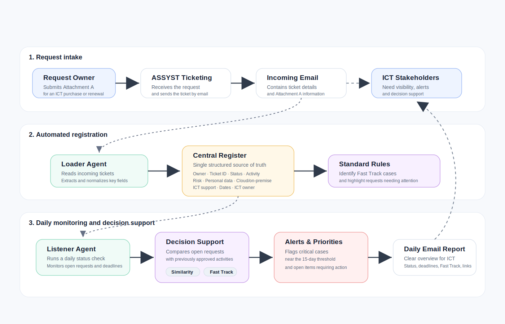

## Indice dei capitoli

| Capitolo | Descrizione |  |
|---|---|---|
| ChatICT | Chatbot RAG per consultare in linguaggio naturale la knowledge base dei servizi ICT. | [Approfondisci](#chatict) |
| Energy Invoice  | Automazione per estrarre, normalizzare e monitorare i dati delle bollette energetiche. | [Approfondisci](#energy-invoice-agent) |
| Allegati A  | Supporto alla gestione, al controllo e al monitoraggio delle richieste di approvazione ICT. | [Approfondisci](#allegati-a-agent) |
| AI Risk Evaluator | Supporto per la redazione di valutazioni tecniche di rischio ICT, cyber e legali per applicazioni AI. | [Approfondisci](#ai-risk-evaluator) |

## ChatICT

ChatICT è un chatbot RAG sviluppato dalla Direzione ICT come primo pilot agentico basato su Generative AI, progettato per rendere interrogabile la conoscenza dei servizi ICT IIT attraverso un’esperienza conversazionale semplice, multilingua e integrata con gli strumenti aziendali.

Il progetto nasce come Proof of Concept e si è evoluto fino a una versione stabile, accessibile agli utenti IIT tramite Microsoft Teams e web app dedicata. L’obiettivo è trasformare documenti tecnici, policy, procedure, guide utente e contenuti di servizio in risposte “ready for users”, riducendo il tempo necessario per trovare informazioni operative e contribuendo a diminuire il carico di lavoro del Front Desk ICT.

Il lavoro ha incluso:

* definizione dell’architettura RAG su piattaforma Microsoft Azure;
* integrazione con Azure Storage per la gestione del corpus documentale;
* utilizzo di Azure AI Search come motore di indicizzazione, hybrid search e vector retrieval;
* integrazione con modelli Azure OpenAI, tra cui la famiglia GPT-4, per la generazione delle risposte;
* utilizzo di modelli di embedding per la rappresentazione vettoriale dei contenuti;
* costruzione e indicizzazione di un Knowledge Scope ICT basato su policy, procedure, user guide e documentazione tecnica.

## Energy Invoice 

Energy Invoice è un agente AI per l’acquisizione, l’elaborazione e la normalizzazione automatica dei dati contenuti nelle bollette energetiche. Il servizio è stato realizzato per ridurre il lavoro manuale di trascrizione, migliorare la qualità dei dati e rendere più tempestivo il monitoraggio dei consumi e dei costi energetici.

Il progetto ha prodotto valore per la Direzione Servizi Tecnici e Facility integrando l’elaborazione documentale nel processo di reporting e revisione budget. I dati estratti vengono consolidati in Excel e alimentano dashboard Power BI aggiornate automaticamente, supportando analisi operative, forecast e simulazioni di spesa.

Il lavoro ha incluso:

* configurazione di un flusso end-to-end con Microsoft Power Automate;
* integrazione di Azure Document Intelligence per OCR avanzato su documenti PDF;
* utilizzo di modelli OpenAI per estrazione semantica e normalizzazione delle variabili chiave;
* progettazione di prompt, system prompt e function calling per la restituzione di dati strutturati;
* esportazione dei dati in tabelle Excel integrate nel modello dati Power BI;
* gestione di logging, notifiche e controlli sugli errori di estrazione.

## Allegati A 

Allegati A è una pipieline agentica sviluppata per supportare la gestione degli Allegati A nel processo di approvazione ICT. Il servizio legge le richieste provenienti dal sistema di ticketing, estrae i dati rilevanti dagli allegati ricevuti via e-mail e aggiorna un registro strutturato, riducendo le attività manuali di inserimento e controllo.

Il progetto ha contribuito a rendere più efficiente e tracciabile il processo di valutazione, introducendo monitoraggio giornaliero, alert sulle scadenze critiche e suggerimenti basati su criteri standardizzati come Fast Track on-premise e Fast Track cloud.

Il lavoro ha incluso:

* implementazione di un Loader Agent per estrazione e normalizzazione dei dati dagli Allegati A ricevuti via e-mail;
* utilizzo di modelli OpenAI per trasformare contenuti non strutturati in record strutturati;
* aggiornamento automatico di un database storico degli Allegati A;
* implementazione di un Listener Agent basato su prompt chaining per il monitoraggio giornaliero delle richieste in corso;
* invio di notifiche e-mail per scadenze, anomalie o richieste da attenzionare;
* definizione di regole Fast Track per richieste on-premise e cloud basate su livello di rischio, supporto ICT, tipologia e certificazione ACN;
* analisi di similarità con approvazioni passate.

 

## AI Risk Evaluator

AI Risk Evaluator è un agente AI sviluppato per supportare la redazione di valutazioni tecniche di rischio in ambito ICT e cyber, per applicazioni di Intelligenza Artificiale, con aprticolare attenzione agli aspetti di conformità legati a GDPR e AI Act. L’agente è copre il ruolo di analista della Direzione Cyber IIT, utilizzando un linguaggio tecnico-formale orientato alla governance del rischio e alla compliance normativa.

Il progetto ha contribuito a standardizzare l’analisi preliminare delle applicazioni centralizzate in ICT e richieste di apporvazioni provenienti dalle unità, rendendo più chiara la valutazione comparativa tra piani, versioni o offerte commerciali dello stesso prodotto. In particolare, l’agente supporta l’identificazione delle differenze rilevanti in termini di sicurezza, trattamento dei dati, auditabilità, responsabilità del fornitore e garanzie contrattuali, producendo valutazioni del rischio utilizzabili come base per successive revisioni tecniche o decisionali da presentare agli Uffici Legali, GDPR e DPO.
