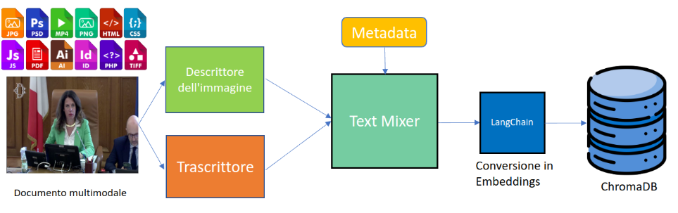

## Indice dei capitoli

| Capitolo | Descrizione |  |
|---|---|---|
| RAG Camera dei deputati | PoC per consultare documenti parlamentari multimodali tramite AI generativa. | [Approfondisci](#rag-camera-dei-deputati) |
| iCub Storytelling | Storytelling collaborativo e multimodale fra utente e robot iCub. | [Approfondisci](#icub-storytelling) |

## RAG Camera dei deputati

Collaborazione con la linea di ricerca [PAVIS](https://pavis.iit.it/) dell’Istituto Italiano di Tecnologia per la redazione di un Proof of Concept candidato alla [Manifestazione d’interesse della Camera dei deputati sull’utilizzo dell’intelligenza artificiale generativa](https://comunicazione.camera.it/eventi/intelligenza-artificiale-Camera-report-comitato-documentazione-lavori-parlamentari).

Il PoC è stato orientato all’ambito “Reperire e organizzare informazioni qualificate” e ha proposto un sistema per la consultazione di documenti parlamentari multimodali, con particolare attenzione alla trasformazione automatica di contenuti audio e video in testo interrogabile. Ho contribuito alla definizione tecnica della proposta, valorizzando un’architettura basata su pipeline offline di conversione media, indicizzazione vettoriale e interrogazione tramite modelli linguistici.

Il lavoro ha incluso:

* supporto alla descrizione dell’architettura applicativa e dei principali moduli del sistema;
* conversione di contenuti audio/video in rappresentazioni testuali tramite componenti speech-to-text e modelli vision-language;
* indicizzazione dei contenuti in database vettoriale per scenari di Retrieval-Augmented Generation;

## iCub Storytelling

La collaborazione tra ICT e [HSP](https://hsp.iit.it/) è nata nel marzo 2026 come evoluzione del lavoro scientifico su [Narrative iCub](https://arxiv.org/html/2508.02505v2), un protocollo di storytelling collaborativo nel quale utente e robot umanoide iCub costruiscono, a turni, una breve storia a partire da stimoli visivi. L’obiettivo è rendere l’interazione narrativa più naturale, adattiva e coinvolgente, ponendo le basi per future applicazioni in ambito educativo, assistivo e riabilitativo.

Il progetto si è sviluppato lungo due linee complementari:

* **Storytelling multimodale**, dedicato alla generazione automatica di storie illustrate a partire da sticker, prompt narrativi e input visivi;
* **Auto Sketch**, orientato alla trasformazione dei disegni realizzati manualmente dall’utente in scene arricchite e narrative, con possibili applicazioni in percorsi di riabilitazione manuale e cognitiva.

Il mio contributo ha riguardato la progettazione e la validazione di una prima architettura multi-agente per la generazione di storie multimodali. Ogni modulo della pipeline era responsabile di una fase specifica del processo generativo: interpretazione degli input visivi, costruzione del contesto narrativo, generazione testuale e produzione delle illustrazioni.

Per coordinare l’interazione tra i moduli è stato adottato il design pattern **Prompt Chaining**: l’output di ciascun agente diventa l’input di quello successivo. Questo approccio ha permesso di orchestrare la generazione passo dopo passo e di preservare la coerenza semantica, la continuità narrativa e lo stile visivo dell’intera storia.

La pipeline è stata successivamente integrata nell’infrastruttura software di iCub, basata su YARP, per realizzare il setup sperimentale impiegato nella campagna di test con soggetti volontari condotta tra giugno e luglio 2026.

<section class="media-carousel" aria-label="Materiali della collaborazione ICT–HSP">
  

    <figure class="media-carousel__slide" id="hsp-media-1">
      
    </figure>
    <figure class="media-carousel__slide" id="hsp-media-2">
      
    </figure>
    <figure class="media-carousel__slide" id="hsp-media-3">
      <video controls preload="metadata" aria-label="Video dimostrativo dello storytelling multimodale">
        <source src="{{ '/images/hsp-collab2.mp4' | relative_url }}" type="video/mp4">
        Il tuo browser non supporta la riproduzione del video.
      </video>
    </figure>
  

  <nav class="media-carousel__navigation" aria-label="Navigazione dei materiali">
    <a href="#hsp-media-1" aria-label="Visualizza la prima immagine">1</a>
    <a href="#hsp-media-2" aria-label="Visualizza la seconda immagine">2</a>
    <a href="#hsp-media-3" aria-label="Visualizza il video">3</a>
  </nav>
</section>
